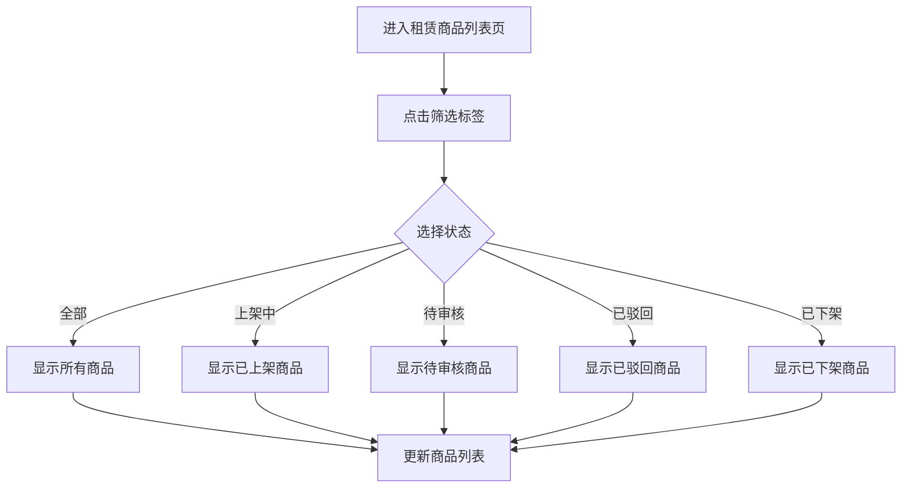
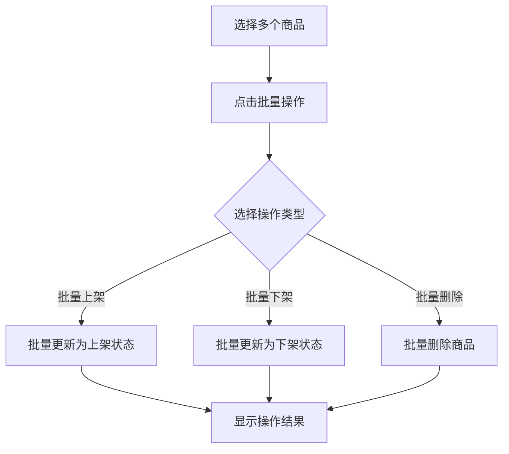

# 门店端租赁商品管理系统 - 产品需求文档

## 1. 产品概述

门店端租赁商品管理系统是一个面向门店工作人员的商品状态管理平台，旨在帮助门店员工高效管理租赁商品的上下架、审核流程和批量操作。系统提供直观的筛选界面，让用户能够快速查看和管理不同状态的租赁商品，提升门店运营效率。

## 2. 核心功能

### 2.1 用户角色

| 角色 | 注册方式 | 核心权限 |
|------|----------|----------|
| 门店员工 | 管理员分配账号 | 商品管理、筛选查看、批量操作 |
| 门店管理员 | 管理员分配账号 | 全部权限 + 审核管理 |

### 2.2 功能模块

1. **租赁商品列表页**: 商品筛选栏、商品列表展示
2. **商品筛选栏**: 多状态筛选、批量操作入口
3. **商品详情页**: 商品信息查看、状态管理

### 2.3 页面详情

| 页面名称 | 模块名称 | 功能描述 |
|----------|----------|----------|
| 租赁商品列表页 | 顶部筛选栏 | 支持按全部、上架中、待审核、已驳回、已下架状态筛选商品 |
| 租赁商品列表页 | 批量操作区 | 支持批量上架、批量下架、批量删除等操作 |
| 租赁商品列表页 | 商品卡片列表 | 展示商品信息、状态标签、操作按钮 |

## 3. 核心流程

### 3.1 商品筛选流程

### 3.2 批量操作流程

## 4. 用户界面设计

### 4.1 设计风格

**视觉风格**: 简洁专业的企业级管理后台风格

**色彩方案**:
- 主色调: `#1890ff` (品牌蓝)
- 成功色: `#52c41a` (上架成功)
- 警告色: `#faad14` (待审核)
- 错误色: `#ff4d4f` (已驳回)
- 灰色: `#8c8c8c` (已下架)
- 背景色: `#f5f5f5` (页面背景)
- 卡片色: `#ffffff` (卡片背景)

**字体方案**:
- 主字体: "PingFang SC", "Microsoft YaHei", sans-serif
- 标题字重: 600
- 正文字重: 400
- 字号范围: 12px - 16px

**布局风格**:
- 顶部筛选栏固定在页面顶部
- 筛选标签采用胶囊式设计
- 卡片式列表布局
- 清晰的视觉层次和间距

**图标风格**:
- 使用线性图标
- 统一的描边宽度
- 简洁明了的设计

### 4.2 页面设计概览

| 页面名称 | 模块名称 | UI 元素 |
|----------|----------|----------|
| 租赁商品列表页 | 顶部筛选栏 | 标签组、选中态、微动效 |
| 租赁商品列表页 | 批量操作区 | 多选框、批量按钮、状态提示 |
| 租赁商品列表页 | 商品卡片 | 图片、标题、价格、状态、操作 |

### 4.3 响应式设计

- 桌面端优先设计
- 平板适配
- 移动端简化展示
- 触摸友好的操作区域

## 5. 功能详细描述

### 5.1 筛选栏功能

**筛选标签**:
- 全部: 显示所有状态的商品
- 上架中: 仅显示已上架的商品
- 待审核: 仅显示待审核状态的商品
- 已驳回: 仅显示被驳回的商品
- 已下架: 仅显示已下架的商品
- 批量操作: 展开批量操作面板

**交互特性**:
- 点击切换即时生效
- 当前选中状态高亮显示
- 支持键盘导航
- 筛选结果数量实时更新

### 5.2 批量操作功能

**支持的操作**:
- 批量上架: 将选中商品状态更新为"上架中"
- 批量下架: 将选中商品状态更新为"已下架"
- 批量删除: 删除选中的商品（需二次确认）

**操作反馈**:
- 进度提示
- 成功/失败提示
- 操作日志记录
