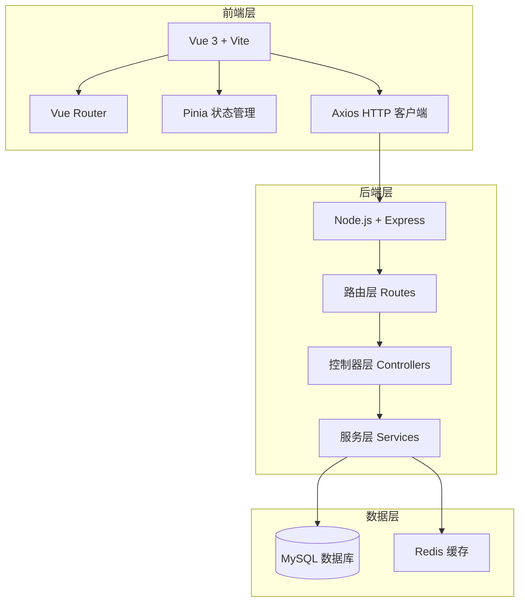
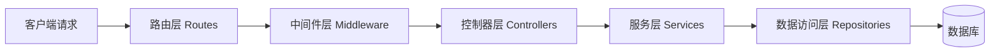

# 门店端租赁商品管理系统 - 技术架构文档

## 1. 架构设计



## 2. 技术栈说明

### 2.1 前端技术

- **核心框架**: Vue 3.4+ (Composition API)
- **构建工具**: Vite 5.0+
- **路由管理**: Vue Router 4.0+
- **状态管理**: Pinia 2.0+
- **HTTP 客户端**: Axios 1.6+
- **UI 组件库**: Element Plus 2.0+
- **样式方案**: SCSS + CSS Variables

### 2.2 后端技术

- **运行环境**: Node.js 18+
- **Web 框架**: Express 4.18+
- **ORM 工具**: Sequelize 6.0+
- **数据库**: MySQL 8.0
- **缓存**: Redis 7.0
- **验证**: JWT Token
- **日志**: Winston

## 3. 路由定义

### 3.1 前端路由

| 路由路径 | 页面名称 | 功能描述 |
|----------|----------|----------|
| / | 首页/商品列表 | 租赁商品列表 + 筛选栏 |
| /product/:id | 商品详情 | 商品详情查看 |
| /product/add | 新增商品 | 添加租赁商品 |

### 3.2 后端 API

| 请求方法 | API 路径 | 功能描述 | 请求参数 |
|----------|----------|----------|----------|
| GET | /api/products | 获取商品列表 | status, page, pageSize |
| GET | /api/products/:id | 获取商品详情 | - |
| POST | /api/products | 创建商品 | 商品信息 |
| PUT | /api/products/:id | 更新商品 | 商品信息 |
| DELETE | /api/products/:id | 删除商品 | - |
| POST | /api/products/batch | 批量操作 | productIds, action |
| PUT | /api/products/:id/status | 更新商品状态 | status |

## 4. API 详细定义

### 4.1 获取商品列表

**请求**
```typescript
GET /api/products?status=all&page=1&pageSize=10
```

**响应**
```typescript
{
  code: 200,
  message: 'success',
  data: {
    list: Product[],
    pagination: {
      page: number,
      pageSize: number,
      total: number,
      totalPages: number
    }
  }
}
```

### 4.2 批量操作

**请求**
```typescript
POST /api/products/batch
{
  productIds: number[],
  action: 'online' | 'offline' | 'delete'
}
```

**响应**
```typescript
{
  code: 200,
  message: '批量操作成功',
  data: {
    successCount: number,
    failCount: number,
    results: BatchResult[]
  }
}
```

### 4.3 数据模型

```typescript
interface Product {
  id: number;
  name: string;
  description: string;
  price: number;
  stock: number;
  status: 'online' | 'pending' | 'rejected' | 'offline';
  images: string[];
  category: string;
  createTime: string;
  updateTime: string;
}

type ProductStatus = 'all' | 'online' | 'pending' | 'rejected' | 'offline';
```

## 5. 服务架构



## 6. 数据模型

### 6.1 商品表 (products)

```sql
CREATE TABLE products (
    id INT PRIMARY KEY AUTO_INCREMENT,
    name VARCHAR(200) NOT NULL COMMENT '商品名称',
    description TEXT COMMENT '商品描述',
    price DECIMAL(10, 2) NOT NULL COMMENT '租赁价格',
    stock INT DEFAULT 0 COMMENT '库存数量',
    status ENUM('online', 'pending', 'rejected', 'offline') DEFAULT 'pending' COMMENT '商品状态',
    images JSON COMMENT '商品图片列表',
    category VARCHAR(100) COMMENT '商品分类',
    created_at TIMESTAMP DEFAULT CURRENT_TIMESTAMP,
    updated_at TIMESTAMP DEFAULT CURRENT_TIMESTAMP ON UPDATE CURRENT_TIMESTAMP,
    INDEX idx_status (status),
    INDEX idx_category (category)
) ENGINE=InnoDB DEFAULT CHARSET=utf8mb4 COMMENT='租赁商品表';
```

## 7. 项目结构

```
├── client/                 # 前端项目
│   ├── src/
│   │   ├── components/    # 公共组件
│   │   │   └── FilterBar.vue      # 筛选栏组件
│   │   ├── views/         # 页面视图
│   │   │   └── ProductList.vue    # 商品列表页
│   │   ├── stores/        # Pinia 状态管理
│   │   │   └── product.js
│   │   ├── api/           # API 接口
│   │   │   └── product.js
│   │   ├── router/        # 路由配置
│   │   └── App.vue
│   └── package.json
│
├── server/                # 后端项目
│   ├── src/
│   │   ├── controllers/   # 控制器
│   │   ├── services/      # 服务层
│   │   ├── routes/        # 路由
│   │   ├── models/        # 数据模型
│   │   └── app.js
│   └── package.json
│
└── README.md
```

## 8. 核心组件设计

### 8.1 筛选栏组件 (FilterBar.vue)

**功能职责**:
- 展示筛选标签（全部、上架中、待审核、已驳回、已下架、批量操作）
- 处理标签切换逻辑
- 管理选中状态
- 触发筛选事件

**Props**:
```typescript
interface FilterBarProps {
  activeStatus: ProductStatus;
  counts: Record<ProductStatus, number>;
  onStatusChange: (status: ProductStatus) => void;
  onBatchAction: (action: BatchAction) => void;
}
```

**Emits**:
- `update:activeStatus`: 状态更新事件
- `batch-action`: 批量操作事件

### 8.2 商品卡片组件 (ProductCard.vue)

**功能职责**:
- 展示单个商品信息
- 管理商品选中状态
- 提供操作按钮
- 显示状态标签

## 9. 环境配置

### 9.1 开发环境

- Node.js: 18.0.0+
- Vue: 3.4.0+
- MySQL: 8.0+
- Redis: 7.0+

### 9.2 环境变量

```env
# 前端 (.env)
VITE_API_BASE_URL=http://localhost:3000/api

# 后端 (.env)
PORT=3000
DB_HOST=localhost
DB_PORT=3306
DB_NAME=rental_products
DB_USER=root
DB_PASSWORD=your_password
REDIS_HOST=localhost
REDIS_PORT=6379
JWT_SECRET=your_secret_key
```
